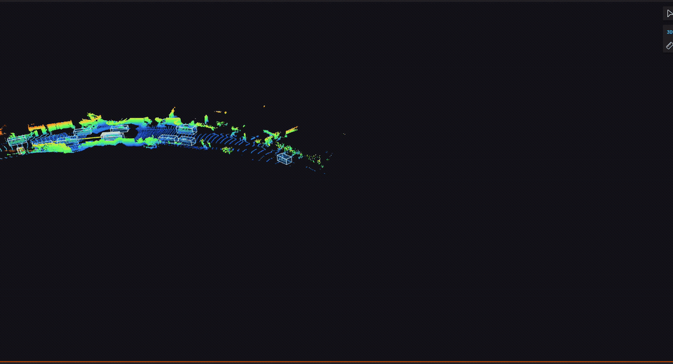

# Throughline

A C++ program that tracks cars, bikes and people in self-driving car LiDAR data.

A Waymo car records a laser scan of everything around it ten times a second. This program
watches those scans and follows each object from one scan to the next. It keeps the same ID on
a car even when it goes behind a truck for a bit. It works out how fast each object is going and
which way it is turning, and it guesses where it will be a few seconds from now.



*Blue boxes are tracked cars. The line in front of each one is where the tracker thinks it is
going.*

## How well it works

The tracker is given Waymo's hand-labelled boxes as its input. It does not detect objects
itself. That means these scores only measure the tracking, and they can't be compared to
leaderboard scores, which include the detector too and come out a lot lower.

MOTA is the standard tracking score. 1.0 means no mistakes. Waymo's own scoring code produced
these numbers on three clips from their dataset.

The last column is a stress test. Real detectors miss objects, so the tracker is also run with
40% of the detections thrown away at random, to see how well it holds tracks through the gaps.

| scene                       | cars | people | cars, 40% of detections removed |
|-----------------------------|------|--------|---------------------------------|
| fast road, 63 km/h          | 0.88 | 0.78   | 0.76                            |
| crawling through a junction | 0.96 | 0.91   | 0.87                            |
| slow turn, 21 km/h          | 0.95 | 0.73   | 0.86                            |

With 40% of detections removed, people score 0.59, 0.82 and 0.66 on the same three scenes.

The fast road is the hardest one. Most of the lost points come from the tracker waiting two
frames before it trusts a new object, and from tracks that keep going for a moment after the
object is gone.

One frame takes 0.07 milliseconds on average and never more than 0.7. The car gives it 100.

## How it works

Every frame, three steps.

1. Move each known object forward using its last speed and turn rate, and get a bit less sure
   where it is.
2. Match the new detections to the known objects. Pairs that are too far apart are thrown out.
   The rest are matched so the total distance is as small as possible.
3. Update matched objects with their new box. Start a new track for any box that didn't match.
   Let unmatched objects coast, and drop them after five misses in a row.

Running the same clip twice gives the exact same output, and a test checks that.

## Build and test

You need `cmake`, `zstd` and `lz4` from Homebrew. The tests make their own fake scene, so you
don't need any data.

```
cmake -S . -B build -DCMAKE_BUILD_TYPE=Release
cmake --build build -j2
./build/tracker_tests
```

Waymo doesn't allow their data to be shared, so the clips above can't be re-run without a Waymo
account. `stage/` turns their data into the tracker's format and `eval/` runs their scoring
code.
